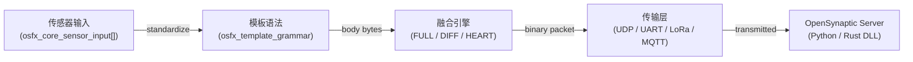

# OSynaptic-FX

English README: [README.md](README.md)

**面向嵌入式的 OpenSynaptic C99 运行库（Arduino 优先）**。它可以把多传感器读数编码为紧凑的二进制数据包，自动发送 FULL 或增量 DIFF 帧，并通过任意传输层（UDP / TCP / UART / LoRa / MQTT / CAN）与 [OpenSynaptic](../OpenSynaptic/README.md) 服务端直接互通。


[](https://www.ardu-badge.com/OSynaptic-FX)


## 30 秒上手

```text
Arduino IDE → Sketch > Include Library > Manage Libraries → 搜索 "OSynaptic-FX" → Install
File > Examples > OSynaptic-FX > EasyQuickStart → Upload
```

Arduino CLI：

```bash
arduino-cli lib install "OSynaptic-FX"
arduino-cli compile --fqbn esp32:esp32:esp32 examples/EasyQuickStart
arduino-cli upload  --fqbn esp32:esp32:esp32 -p /dev/ttyUSB0 examples/EasyQuickStart
```

以 **115200 波特率** 打开串口监视器，即可看到二进制 DIFF 数据包持续输出。

---

## 目录

- [为什么选择 OSynaptic-FX](#为什么选择-osynaptic-fx)
- [架构](#架构)
- [内存占用](#内存占用)
- [快速开始（代码）](#快速开始代码)
- [按目标平台调优](#按目标平台调优)
- [二进制 DIFF 协议](#二进制-diff-协议)
- [示例](#示例)
- [仓库结构](#仓库结构)
- [CMake 构建](#cmake-构建)
- [预编译归档](#预编译归档)
- [能力概览](#能力概览)
- [文档索引](#文档索引)
- [贡献](#贡献)
- [常见问题](#常见问题)

---

## 为什么选择 OSynaptic-FX

- **ESP32 上默认 DRAM 安全**：默认配置约占 27 KB DRAM，所有限制都能通过 `#ifndef` 在编译期覆盖。
- **二进制 DIFF 包**：只发送发生变化的传感器槽位，适合多传感器、带宽敏感节点。
- **规范驱动**：实现与 OpenSynaptic Python/Rust 服务端共用同一协议规范，不需要额外胶水层。
- **支持零动态分配**：开启 `OSFX_CFG_MULTI_SENSOR_STATIC_SCRATCH 1` 后，运行期数据全部位于静态缓冲区。
- **可移植 C99**：可在 AVR、ESP32、STM32、RP2040、RISC-V 与裸机 Cortex-M 上通过 `-Wall -Wextra` 编译。

---

## 架构



数据链路如下：

```text
osfx_core_sensor_input[]
  → osfx_template_grammar_encode()   # 生成 UCUM 规范化后的 body 字节
  → osfx_fusion_encode()             # 首包 FULL，随后自动切换为 DIFF / HEART
  → transport callback               # 通过 UDP / Serial / LoRa 等输出
```

服务端由 OpenSynaptic 项目中的 `OSVisualFusionEngine` 与 `codec.py` 负责解码。

---

## 内存占用

以下数值基于 ESP32 默认 `osfx_user_config.h` 设置（v1.0.0）：

| 组件 | DRAM（BSS/DATA） | 说明 |
|---|---|---|
| `osfx_easy_context` | 约 14 KB | 包含融合状态与模板缓存 |
| ID 分配器（`OSFX_ID_MAX_ENTRIES=128`） | 约 5 KB | `id_entry` × 128 |
| Body scratch buffer（`BODY_CAP=512`） | 512 B | 当 `STATIC_SCRATCH=1` 时为静态分配 |
| 典型总占用 | **约 20 KB** | 远低于 ESP32 160 KB DRAM 上限 |

对于更紧张的平台（AVR / Cortex-M0），建议把 `OSFX_FUSION_MAX_ENTRIES` 降到 8–16，把 `OSFX_ID_MAX_ENTRIES` 降到 32。

---

## 快速开始（代码）

### 最小单传感器节点

```c
#include <OSynapticFX.h>

static osfx_easy_context g_ctx;
static uint8_t           g_buf[256];

void setup() {
    Serial.begin(115200);
    osfx_easy_init(&g_ctx);
    osfx_easy_set_node(&g_ctx, "NODE_A", "ONLINE");
    osfx_easy_set_tid(&g_ctx, 1U);
    osfx_easy_init_id_allocator(&g_ctx, 100U, 10000U, 86400U);
}

void loop() {
    osfx_core_sensor_input s = {0};
    strncpy(s.tag,   "TEMP",  sizeof(s.tag));
    strncpy(s.value, "23.5",  sizeof(s.value));
    strncpy(s.unit,  "Cel",   sizeof(s.unit));

    int len = 0;
    uint8_t cmd = 0;
    uint64_t ts = 1710000000ULL + millis() / 1000ULL;

    int r = osfx_easy_encode_sensor_auto(&g_ctx, &s, 1, ts, g_buf, sizeof(g_buf), &len, &cmd);
    if (r == 0) {
        Serial.write(g_buf, len);
    }
    delay(1000);
}
```

### ESP32 多传感器节点

完整 Wi-Fi UDP 示例见 [examples/ESP32WiFiMultiSensorAuto](examples/ESP32WiFiMultiSensorAuto/ESP32WiFiMultiSensorAuto.ino)。它包含 4 个传感器、LittleFS 上的 ID 持久化，以及自动 FULL/DIFF 切换。

---

## 按目标平台调优

所有限制都可以在包含任何 OSynaptic-FX 头文件前重写。常见做法是修改 [include/osfx_user_config.h](include/osfx_user_config.h)，或者在构建系统里传入 `-D` 参数：

```c
#define OSFX_FUSION_MAX_ENTRIES   16
#define OSFX_ID_MAX_ENTRIES       64
#define OSFX_TMPL_MAX_SENSORS      4
#define OSFX_CFG_MULTI_SENSOR_BODY_CAP  256
#define OSFX_CFG_MULTI_SENSOR_STATIC_SCRATCH  1
#define OSFX_CFG_PAYLOAD_GEOHASH       0
#define OSFX_CFG_PAYLOAD_SUPP_MSG      1
#define OSFX_CFG_PAYLOAD_RESOURCE_URL  0
```

推荐的板级预设可通过 CMake 传入 `-DOSFX_ARCH_PRESET=<name>`：

| 架构 | 示例板卡 | 预设 | `MAX_ENTRIES` | `ID_MAX` | `BODY_CAP` |
|---|---|---|---|---|---|
| Cortex-M0+ | RP2040, STM32C0 | `cortexm0plus` | 32 | 64 | 256 B |
| Cortex-M4 | STM32F4, SAMD51 | `cortexm4` | 64 | 128 | 512 B |
| Xtensa | ESP32, ESP32-S3 | `esp32` | 128 | 256 | 1 KB |
| AVR large | ATmega2560 | `avr2560` | 16 | 16 | 64 B |
| AVR small | ATmega328P | `avr328p` | 8 | 8 | 32 B |
| x86_64 | Linux / Windows | `x86_64` | 256 | 512 | 4 KB |

> ATmega328P 上更适合编码路径，不建议完整调用高栈占用的复杂解码流程。

---

## 二进制 DIFF 协议

OSynaptic-FX v1.0.0 默认输出与 OpenSynaptic Rust 解码器兼容的 **二进制 bitmask DIFF**：

```text
[ mask_bytes (big-endian, ceil(N/8) bytes) ]
  for each changed slot i:
    [ uint8 length ] [ value bytes ]
```

- **FULL**：首次发送以及每隔 `OSFX_FUSION_FULL_INTERVAL` 次发送一次，全槽位置位。
- **DIFF**：只携带变化槽位。
- **HEART**：空心跳包，用于保活和刷新服务端 DIFF 定时器。

---

## 示例

| 示例 | 板卡 | 难度 | 说明 |
|---|---|---|---|
| [EasyQuickStart](examples/EasyQuickStart/EasyQuickStart.ino) | Any | ★☆☆ | 最小 `osfx_easy` API 入门 |
| [BasicEncode](examples/BasicEncode/BasicEncode.ino) | Any | ★☆☆ | 单传感器 FULL 编码 |
| [MultiSensorNodePacket](examples/MultiSensorNodePacket/MultiSensorNodePacket.ino) | Any | ★★☆ | 4 传感器模板包编码/解码 |
| [FusionAutoMode](examples/FusionAutoMode/FusionAutoMode.ino) | Any | ★★☆ | 自动 FULL → DIFF → HEART |
| [FusionModeTest](examples/FusionModeTest/FusionModeTest.ino) | Any | ★★☆ | 可断言的模式切换测试 |
| [ESP32WiFiMultiSensorAuto](examples/ESP32WiFiMultiSensorAuto/ESP32WiFiMultiSensorAuto.ino) | ESP32 | ★★★ | Wi-Fi UDP 多传感器节点 |
| [QuickBench](examples/QuickBench/QuickBench.ino) | ESP32 | ★★★ | 双核吞吐基准测试 |

---

## 仓库结构

```text
OSynaptic-FX/
├── CMakeLists.txt
├── cmake/
├── library.properties
├── keywords.txt
├── src/
│   ├── OSynapticFX.h
│   ├── osfx_easy.c
│   ├── osfx_storage.c
│   └── osfx_storage_littlefs.c
├── include/
│   ├── osfx_user_config.h
│   ├── osfx_build_config.h
│   ├── osfx_easy.h
│   └── ...
├── examples/
├── tests/
├── scripts/
├── docs/
└── tools/
```

---

## CMake 构建

### 本机构建

```bash
cmake -B build -DOSFX_BUILD_EASY_API=ON
cmake --build build
```

### 交叉编译

```bash
cmake -B build-rp2040 -DCMAKE_TOOLCHAIN_FILE=cmake/toolchains/rp2040.cmake -DOSFX_BUILD_EASY_API=ON
cmake --build build-rp2040
```

支持的 toolchain 包括 `rp2040`、`arm-cortexm4`、`riscv32-elf`、`android-aarch64`、`ios-arm64`、`wasm-emscripten`。

PowerShell 自动化：

```powershell
powershell -ExecutionPolicy Bypass -File scripts/build.ps1 -Compiler auto
powershell -ExecutionPolicy Bypass -File scripts/test.ps1  -Compiler auto
```

常用 CMake 选项：

| 选项 | 默认值 | 说明 |
|---|---|---|
| `OSFX_BUILD_EASY_API` | `OFF` | 是否编译 `osfx_easy` 和 `osfx_storage` |
| `OSFX_ENABLE_FILE_IO` | `OFF` | 是否启用持久化存储 |
| `OSFX_ENABLE_CLI` | `OFF` | 是否启用 CLI 路由 |
| `OSFX_ENABLE_LTO` | `OFF` | 是否启用 LTO |

---

## 预编译归档

Arduino IDE 默认从源码编译，这也是推荐方式。预编译 `.a` 主要用于覆盖源码路径的特定工具链场景。

执行：

```powershell
scripts/build.ps1 -Matrix
```

常见归档输出路径：

| 架构 | 预设 | 归档 |
|---|---|---|
| x86_64 | `x86_64` | `src/host/libOSynapticFX.a` |
| Cortex-M4 | `cortexm4` | `src/cortex-m4/libOSynapticFX.a` |
| RISC-V 32 | `riscv32` | `src/riscv32/libOSynapticFX.a` |
| ESP32 | `esp32` | `src/esp32/libOSynapticFX.a` |
| AVR ATmega328P | `avr328p` | `src/avr/atmega328p/libOSynapticFX.a` |
| AVR ATmega2560 | `avr2560` | `src/avr/atmega2560/libOSynapticFX.a` |

---

## 能力概览

| 模块 | 能力 |
|---|---|
| Codecs | Base62 i64、CRC8、CRC16/CCITT |
| Packet | FULL 编码、最小元数据解码 |
| Fusion | FULL → DIFF → HEART 状态机 |
| Security | 会话持久化、AES 载荷加密 |
| Transport | 基于回调的传输抽象 |
| Template | 多传感器模板语法 |
| Platform | ID 分配器、插件运行时、CLI 路由 |

---

## 文档索引

推荐入口：

- [docs/README.md](docs/README.md)
- [docs/SUMMARY.md](docs/SUMMARY.md)

集成指南：

- [docs/17-glue-step-by-step.md](docs/17-glue-step-by-step.md)
- [docs/18-data-format-specification.md](docs/18-data-format-specification.md)
- [docs/19-input-specification.md](docs/19-input-specification.md)

协议与发送接口：

- [DATA_FORMATS_SPEC.md](DATA_FORMATS_SPEC.md)
- [SEND_API_INDEX.md](SEND_API_INDEX.md)
- [SEND_API_REFERENCE.md](SEND_API_REFERENCE.md)
- [QUICK_START_SEND_EXAMPLES.md](QUICK_START_SEND_EXAMPLES.md)

服务端：

- [../OpenSynaptic/README.md](../OpenSynaptic/README.md)

---

## 贡献

1. 修改编码/解码路径前，先阅读 [DATA_FORMATS_SPEC.md](DATA_FORMATS_SPEC.md)。
2. `src/` 的改动应同时保持 PowerShell 和 CMake 构建链路可用。
3. 运行本地测试：`powershell -ExecutionPolicy Bypass -File scripts/test.ps1 -Compiler auto`
4. 该仓库是当前单一事实来源，不要把修改回同步到已废弃镜像。
5. 文档更新应尽量放到最贴近模块归属的 `docs/` 文件中，避免 README 与 docs 重复漂移。

---

## 常见问题

**没有 Wi-Fi / 网络也能用吗？**  
可以。传输层是回调式的，只需要提供任意 `write(buf, len)` 函数，例如 Serial、LoRa、CAN。

**必须配合 OpenSynaptic 服务端吗？**  
不是。编码/解码器本身是独立的，另一块 MCU 也可以使用 `osfx_fusion_decode_apply()` 直接解码。

**如何持久化设备 ID？**  
调用 `osfx_easy_save_ids()` 和 `osfx_easy_load_ids()`。ESP32 + LittleFS 的完整示例见 `ESP32WiFiMultiSensorAuto`。

**哪里设置项目级内存限制？**  
在 [include/osfx_user_config.h](include/osfx_user_config.h) 中重写 `OSFX_FUSION_MAX_*`、`OSFX_ID_MAX_ENTRIES` 与各类 `OSFX_CFG_*` 宏即可。